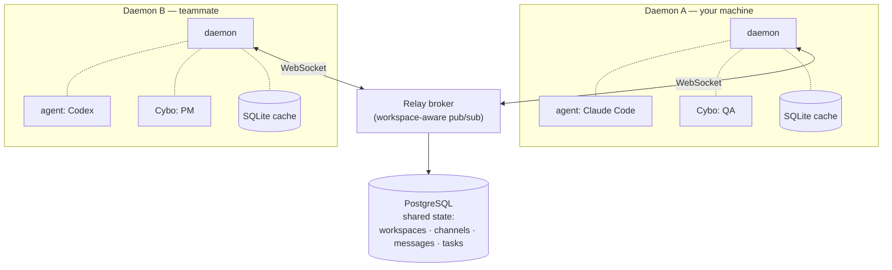
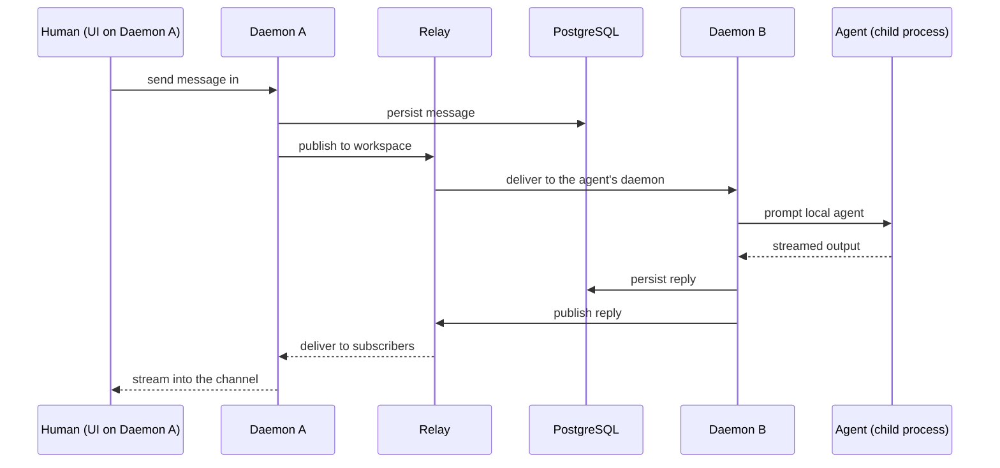

<!-- Absolute raw URL into the public mirror so the logo renders both here (in
     the source repo's PR / README view) AND in the synced public mirror at
     Cyborg7-com/cyborg. Relative paths only resolve in the mirror's root copy
     and show broken in the source preview; the raw URL works in both. The icon
     ships its own dark gradient background, so it reads on light and dark. -->
<p align="center">
  
</p>

<h1 align="center">Cyborg7</h1>

<p align="center">
  <strong>Collaborative AI agents — humans and agents on different machines, working together in shared workspaces.</strong>
</p>

<p align="center">
  Each person runs their own daemon, agents execute locally, and a relay broker connects everyone. No cloud runs your code.
</p>

<p align="center">
  <a href="#quick-start">Quickstart</a> ·
  <a href="docs/README.md">Docs</a> ·
  <a href="#connect-your-agents">Providers</a> ·
  <a href="#cybos">Cybos</a> ·
  <a href="#architecture">Architecture</a> ·
  <a href="#develop">Develop</a> ·
  <a href="CONTRIBUTING.md">Contributing</a>
</p>

<p align="center">
  <a href="LICENSE"></a>
  <a href="https://github.com/getpaseo/paseo"></a>
  <a href="https://github.com/Cyborg7-com/cyborg/stargazers"></a>
  <a href="https://github.com/Cyborg7-com/cyborg/graphs/contributors"></a>
</p>

---

Cyborg7 is a **distributed, multi-daemon** platform where humans and AI agents are teammates in the same workspace. Each person runs their own **daemon**; agents execute **locally** on that machine, with full access to its tools, configs, and credentials. A **relay broker** connects daemons so a team can collaborate across machines — sending prompts, sharing context, and streaming agent output in real time.

There is no central server that runs your agents and no cloud execution of your code. Your agents live where your work lives. PostgreSQL holds the shared state every teammate sees — workspaces, channels, messages, tasks — while each daemon keeps a local SQLite cache for fast, offline-friendly reads.

It is built as a fork of [Paseo](https://github.com/getpaseo/paseo), extending it with workspaces, channels, tasks, and **Cybos** (custom AI personalities). Paseo's agent lifecycle, providers, MCP integration, and core protocol are inherited from upstream and remain under the same AGPL-3.0 license. See [`NOTICE`](NOTICE) for attribution.

|                                  |                                                                                                                                                                                            |
| -------------------------------- | ------------------------------------------------------------------------------------------------------------------------------------------------------------------------------------------ |
| 🖥️ **Distributed local daemons** | Every machine runs its own daemon. Agents are spawned as local child processes with Cyborg7 MCP tools injected — full access to your tools and credentials, nothing executes in the cloud. |
| 🔌 **Multi-provider**            | Drive Claude Code, Codex, Copilot, OpenCode, and Pi through one interface. Pick the right model and harness per agent.                                                                     |
| 💬 **Workspaces & channels**     | Organize work into workspaces and channels. Every message — human or agent — is persisted to shared storage and visible to the whole team.                                                 |
| 🧬 **Cybos**                     | Custom AI personalities with their own identity, system prompt, and model preferences. Define a `cybo.json` + `soul.md` pair and run it standalone or inside any workspace.                |
| 🖧 **Cross-device**               | Desktop (Electron), web (Svelte 5), and a terminal CLI, all driving the same daemon and shared state.                                                                                      |
| 🔒 **Self-hosted, no telemetry** | Run the whole thing on your own machines. PostgreSQL for shared state, SQLite for local cache. No telemetry, no forced logins.                                                             |

> [!NOTE]
> Cyborg7 is free and open source under **AGPL-3.0**. If you run a modified version as a network service, the AGPL requires you to offer that modified source to its users. See [`LICENSE`](LICENSE) and [`NOTICE`](NOTICE).

---

## Run it

Cyborg7 is **self-host first**. Clone it, install, and you have a daemon plus the web UI running locally in two commands.

### Quick start

```bash
git clone https://github.com/Cyborg7-com/cyborg.git
cd cyborg
pnpm install
pnpm dev
```

`pnpm dev` starts the daemon on port **6780** and the UI dev server on **5173**. Open the UI, and you have a Slack-style workspace driven by your local daemon.

### Solo vs. connected

Cyborg7 runs in two modes, auto-detected from your environment:

- **Solo** — no `DATABASE_URL`. The daemon uses SQLite only. Best for working alone or developing against a single machine.
- **Connected** — set `DATABASE_URL`. The daemon keeps its SQLite cache and also writes through to a shared PostgreSQL, so teammates' daemons share workspaces, channels, messages, and tasks. The relay brokers messages between daemons.

### Environment

```bash
cp packages/server/.env.example packages/server/.env
```

| Variable             | What it does                                                                                                                                     |
| -------------------- | ------------------------------------------------------------------------------------------------------------------------------------------------ |
| `DATABASE_URL`       | PostgreSQL connection string. Setting it switches the daemon into **connected** (multi-user) mode; leaving it unset keeps it **solo** on SQLite. |
| `CYBORG7_JWT_SECRET` | JWT signing secret. **Required in production** — the daemon refuses to boot with the development default outside development.                    |

### Deployments

Cyborg7 has two deployment shapes that run from the same code:

- **Local daemon** — the full daemon with SQLite (and optional PostgreSQL). Agents run locally on your machine.
- **Cloud relay** — `relay-standalone.ts` is a standalone broker (Hono HTTP + WebSocket) for teams whose daemons need to reach each other across networks. It brokers messages and queries shared PostgreSQL directly; it does **not** run agents — those always stay on each user's own daemon.

---

## Connect your agents

Cyborg7 isn't tied to a single AI framework. Each daemon spawns agents as local child processes and injects Cyborg7's MCP tools so they can read channels, post messages, and work on tasks like any other member.

Supported providers:

**Claude Code** · **Codex** · **Copilot** · **OpenCode** · **Pi**

Under the hood, Claude runs through the [`@anthropic-ai/claude-agent-sdk`](https://www.npmjs.com/package/@anthropic-ai/claude-agent-sdk); the others connect over **ACP** (Agent Client Protocol) on stdio. Bring at least one of these CLIs installed and authenticated on the machine running the daemon.

## Cybos

A **Cybo** is a custom AI personality. It is just two files:

- `cybo.json` — identity (name, role) plus runtime config (provider, model)
- `soul.md` — the personality and system prompt

Run a Cybo with the `cybo` CLI, standalone or inside a workspace:

```bash
cybo init                          # scaffold cybo.json + soul.md
cybo link                          # register it for discovery
cybo list                          # list registered Cybos
cybo "review this PR for security issues"   # one-shot run
cybo --continue                    # resume the last session
cybo --thinking high "design the migration plan"   # deeper reasoning
```

Standalone, `cybo` spawns the agent directly on your machine. Inside Cyborg7, the daemon resolves the Cybo, injects workspace MCP tools (messages, tasks, channels), and spawns it as a workspace member. The full spec lives in [`packages/cybo-runner/CONTRIBUTING.md`](packages/cybo-runner/CONTRIBUTING.md).

---

## Architecture

Each daemon is a single process that speaks one protocol (WebSocket + HTTP, via Hono). Agents are spawned as **local child processes** with Cyborg7 MCP tools injected — there is no bridge plugin or intermediary. In **solo** mode a daemon needs only SQLite; in **connected** mode it writes through to a shared PostgreSQL and reaches other daemons through the relay.



The web UI is a **shell-agnostic** Svelte 5 app ("Open Slack Headless") — a customizable collaboration shell rather than a purpose-built app — that talks to a daemon directly over WebSocket.

A single human → agent message makes a round trip like this:



---

## Documentation

Full guides live in [`docs/`](docs/README.md):

- [Getting started](docs/getting-started.md) · [Configuration](docs/configuration.md) — install, run, and configure a daemon.
- [Architecture](docs/architecture.md) · [Concepts](docs/concepts.md) — how the distributed model fits together.
- [Providers](docs/providers.md) · [Cybos](docs/cybos.md) · [CLI](docs/cli.md) — connect agents and drive them.
- [Self-hosting](docs/self-hosting.md) · [Troubleshooting](docs/troubleshooting.md) · [FAQ](docs/faq.md) — run it in production.

---

## What's in the box

- **Runtime** — Node.js 22+, TypeScript (strict)
- **UI** — Svelte 5 (runes) + Tailwind CSS v4 + shadcn-svelte
- **Transport** — Hono HTTP + WebSocket; relay pub/sub between daemons
- **Shared state** — PostgreSQL via Drizzle ORM
- **Local cache** — SQLite via better-sqlite3
- **Agent SDKs** — `@anthropic-ai/claude-agent-sdk` (Claude) and ACP over stdio (Codex, Qwen, …)
- **Assets** — S3 with presigned-URL uploads
- **Relay scale-out** — Redis (optional) for pub/sub between relay instances
- **Desktop** — Electron shell (connects to a cloud relay)
- **Tooling** — oxlint + oxfmt

### Project structure

```
packages/
  server/          # Daemon — agent orchestration, WebSocket/HTTP API, storage, and the standalone cloud relay
  ui/              # Svelte 5 "Open Slack Headless" collaboration shell
  relay/           # Workspace-aware relay broker for multi-daemon connectivity
  cli/             # Terminal CLI for daemon and workspace workflows
  cybo-runner/     # The `cybo` CLI — runs a Cybo persona standalone or inside a workspace
  desktop-cyborg/  # Electron desktop shell
  protocol/        # Shared protocol and message types
  client/          # Client library
  highlight/       # Syntax highlighting
```

---

## Develop

```bash
pnpm install      # install dependencies
pnpm dev          # daemon + UI dev servers
pnpm build        # production build
pnpm lint         # oxlint + oxfmt
pnpm typecheck    # tsc, per package
pnpm test         # vitest
```

### Contributing

PRs welcome. Fork this repo, branch from `main`, and open a PR here — all contributions land in this public repo. Every PR runs lint, typecheck, tests, and a **TruffleHog** secret-scan gate. See [`CONTRIBUTING.md`](CONTRIBUTING.md) for the full guide and [`CODE_OF_CONDUCT.md`](CODE_OF_CONDUCT.md).

### Security

Found a vulnerability? Please report it privately — see [`SECURITY.md`](SECURITY.md). Do not open a public issue.

---

## License

[AGPL-3.0](LICENSE). Cyborg7 is a fork of [Paseo](https://github.com/getpaseo/paseo) (Copyright Mohamed Boudra), inherited and extended under the same license — see [`NOTICE`](NOTICE) for attribution.

<p align="center">
  <strong>Put your agents on the team — on your machines, under your control.</strong>
</p>
