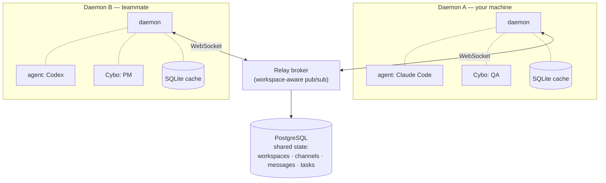
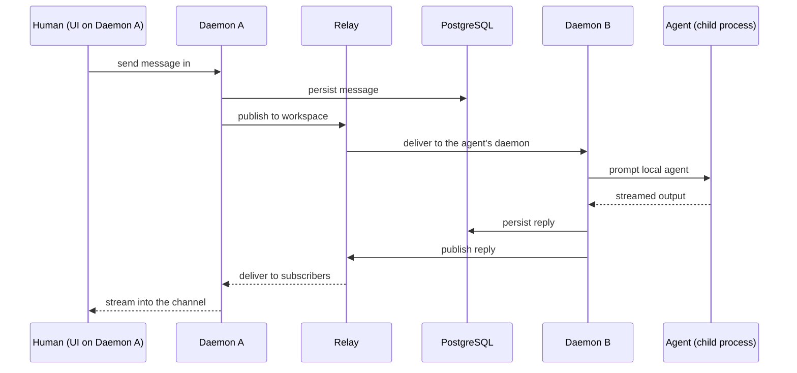

# Architecture

Cyborg7 is a **distributed, multi-daemon** platform. Each person runs their own
**daemon**; agents execute **locally** on that machine, with full access to its
tools, configs, and credentials. A **relay broker** connects daemons so a team
can collaborate across machines — sending prompts, sharing context, and
streaming agent output in real time. There is no central server that runs your
agents and no cloud execution of your code.

This document goes deeper than the [README](../README.md): it explains the
single-process daemon, agents as local child processes, the relay broker,
DualStorage, the two run modes, the two deployment shapes, and how a human →
agent message travels the system end to end. For the vocabulary used here —
workspaces, channels, tasks, daemons, agents, and Cybos — see
[Concepts](./concepts.md). To run any of this on your own infrastructure, see
[Self-hosting](./self-hosting.md).

Cyborg7 is a fork of [Paseo](https://github.com/getpaseo/paseo). Paseo's agent
lifecycle, providers, MCP integration, and core protocol are inherited from
upstream; Cyborg7 adds workspaces, channels, tasks, and Cybos on top. Everything
is licensed under [AGPL-3.0](../LICENSE); see [`NOTICE`](../NOTICE) for
attribution.

---

## The daemon: one process, one protocol

The daemon is the unit that everything runs in. It is a single Node.js process
that speaks **one protocol** — WebSocket plus HTTP, both served by
[Hono](https://hono.dev). Clients (the web UI, the desktop shell, the terminal
CLI) connect to a daemon over that one transport; there is no second port, no
separate real-time service, and no message bus between the client and the
daemon. The daemon already _is_ the WebSocket server, so the UI talks to it
directly.

A daemon is responsible for:

- **Serving clients** — the WebSocket/HTTP API the UI and CLI drive.
- **Running agents** — spawning provider processes as local child processes and
  streaming their output back.
- **Storage** — a local SQLite cache and, in connected mode, a write-through to
  shared PostgreSQL (see [DualStorage](#dualstorage-local-cache-shared-state)).
- **Relay connectivity** — in connected mode, an outbound WebSocket to the relay
  so this daemon's workspaces stay in sync with everyone else's.

Because each person runs their own daemon, an agent runs on the same machine as
the work it is doing. A teammate's client never has to round-trip through a
remote server to reach an agent that lives on the local machine, and any one
daemon can go offline without taking the rest of the team down with it.

### Configuration that shapes the daemon

A handful of environment variables decide how a daemon behaves. The full,
authoritative list lives in the source `.env.example` and in
[Self-hosting](./self-hosting.md); the ones that change the _architecture_ are:

| Variable             | Effect                                                                                                                                                             |
| -------------------- | ------------------------------------------------------------------------------------------------------------------------------------------------------------------ |
| `DATABASE_URL`       | Presence of a PostgreSQL connection string switches the daemon from **solo** to **connected** mode. Unset → SQLite only.                                           |
| `PASEO_HOME`         | Where the daemon keeps its runtime state (agents, local database, config).                                                                                         |
| `PASEO_LISTEN`       | The address the daemon binds. In the source `.env.example` this defaults to `127.0.0.1:6767`.                                                                      |
| `CYBORG7_JWT_SECRET` | The JWT signing secret. **Required in production** — the daemon refuses to boot with the development default when `NODE_ENV=production`, to prevent token forgery. |
| `CYBORG7_PTY_HOST`   | Terminal persistence is on by default; set `CYBORG7_PTY_HOST=0` (also `false`/`off`) to fall back to the in-process worker.                                        |

> [!NOTE]
> `pnpm dev` starts the daemon and the UI dev server for local development; the
> ports it prints can differ from the `PASEO_LISTEN` default in `.env.example`.
> Treat the source as authoritative for what each variable does — see
> [Self-hosting](./self-hosting.md).

---

## Agents are local child processes

When a daemon starts an agent, it **spawns a local child process** for the
chosen provider and injects Cyborg7's MCP tools into it. There is no bridge
plugin, adapter, or intermediary class between the daemon and the agent — the
agent is a real process on the same machine, with the same access to tools,
files, and credentials that the person running the daemon has.

The injected MCP tools are what make an agent a first-class teammate rather than
a detached process: through them, the agent can read channels, post messages,
and work on tasks exactly like a human member. Every message an agent produces —
like every message a human produces — flows through the daemon and is persisted
to shared storage, so the whole workspace sees it.

### Providers

Cyborg7 is not tied to a single AI framework. A daemon can drive several
providers:

**Claude Code · Codex · Copilot · OpenCode · Pi**

Under the hood there are two integration paths:

- **Claude** runs through the
  [`@anthropic-ai/claude-agent-sdk`](https://www.npmjs.com/package/@anthropic-ai/claude-agent-sdk).
- **The others** connect over **ACP** (Agent Client Protocol) on stdio.

Either way, the provider CLI must be installed and authenticated on the machine
running the daemon. Bring at least one. See [Providers](./providers.md) for
details on each, and [Concepts](./concepts.md) for how **Cybos** layer a custom
identity and system prompt on top of a provider.

---

## DualStorage: local cache, shared state

Cyborg7 uses two stores with clearly separated jobs:

- **PostgreSQL — shared state.** Everything a team needs to see the same way:
  workspaces, channels, messages, and tasks. This is the source of truth that
  every teammate's daemon converges on.
- **SQLite (via `better-sqlite3`) — per-daemon local cache.** Recent data kept
  close to the daemon for fast, offline-friendly reads.

`DualStorage` is the layer that ties them together, and its rule is simple:

- **Reads go to SQLite** — fast, local, and available even when the relay or
  PostgreSQL is not reachable.
- **Writes go to SQLite first, then to PostgreSQL** — the write-through to
  PostgreSQL happens asynchronously, so a write is never blocked on the network.

The **mode is auto-detected** from `DATABASE_URL`. With no `DATABASE_URL`,
`DualStorage` wraps SQLite alone. With `DATABASE_URL` set, it wraps SQLite _and_
a PostgreSQL sync, and the daemon participates in shared state. Every consumer of
storage — workspace management, message routing, the dispatcher, auth, and the
MCP tools — takes the same `DualStorage` and does not need to know which mode it
is in.

> Managed PostgreSQL (for example, a hosted instance that requires TLS) is
> supported; the daemon negotiates SSL when the connection string calls for it.
> Use placeholder hosts like `your-db-host` in your own configuration.

---

## Two run modes: solo and connected

The mode follows directly from whether `DATABASE_URL` is set.

| Mode          | Condition          | Behavior                                                                                                                                       |
| ------------- | ------------------ | ---------------------------------------------------------------------------------------------------------------------------------------------- |
| **Solo**      | No `DATABASE_URL`  | SQLite only. Single machine, local-only. Best for working alone or developing against one daemon.                                              |
| **Connected** | `DATABASE_URL` set | SQLite cache **plus** shared PostgreSQL. Daemons share workspaces, channels, messages, and tasks, and the relay brokers messages between them. |

Solo mode is fully functional on its own — you get the entire workspace
experience driven by a single local daemon. Connected mode is what turns a set of
individual daemons into a team: a shared PostgreSQL gives everyone the same
state, and the relay carries live traffic between machines.

---

## The relay broker

In connected mode, daemons do not talk to each other directly — they connect to a
**relay**, which is a **workspace-aware message broker**. Where Paseo's relay is
a point-to-point tunnel (one client to one daemon), Cyborg7's relay is extended
into pub/sub: many daemons subscribe to the workspaces they belong to, and the
relay routes each message to every daemon subscribed to that workspace.

The relay's job is routing and coordination, not computation:

- **Subscriptions** — a daemon connects and subscribes to the workspaces it is a
  member of. The relay routes messages only to the daemons subscribed to a given
  workspace; it cannot route across workspace boundaries.
- **Fan-out** — when a message is published to a workspace, the relay delivers it
  to all subscribed daemons in real time.
- **Ordering** — the relay is the single point of ordering per workspace, so
  messages have a consistent sequence for every daemon, and a daemon that was
  offline can catch up cleanly on reconnect.
- **Liveness** — the relay tracks which daemons are connected and healthy, so the
  system knows where an agent can be reached.

Crucially, **the relay does not run agents.** Agents always execute on the
daemon that owns them. The relay carries prompts to that daemon and carries the
agent's streamed output back out to subscribers.

---

## How daemons fit together

Each daemon keeps its own SQLite cache and its own local agents. The relay sits
between them as the broker; PostgreSQL holds the shared state every daemon
converges on. Add or remove a daemon and the rest of the team is unaffected.

---

## Two deployment shapes from the same code

The same codebase runs in two shapes, depending on whether it needs to execute
agents:

### Local daemon

The full daemon, as described above: it serves clients, runs agents as local
child processes, keeps a SQLite cache, and (in connected mode) writes through to
PostgreSQL and connects to the relay. This is what you run on each person's
machine.

### Cloud relay (`relay-standalone.ts`)

`relay-standalone.ts` is a **standalone broker** — a Hono HTTP + WebSocket
service for teams whose daemons need to reach each other across networks. It
queries the shared PostgreSQL directly to serve workspace, channel, member, and
task data, brokers messages between daemons, and handles auth and asset uploads.

What it **does not** do is run agents. When a message is destined for a local
agent, the relay forwards it to the daemon that owns that agent; the agent always
runs on someone's own daemon, never on the relay. This is the broker half of the
system without the execution half.

The desktop shell (an Electron app) and the web UI can connect through a cloud
relay, while agents stay on each user's daemon. For how to stand a relay up
yourself — using placeholder hosts like `https://relay.example.com` — see
[Self-hosting](./self-hosting.md).

---

## End to end: a human → agent message

Putting the pieces together, here is the round trip when a person on Daemon A
sends a message that an agent on Daemon B should answer.

Step by step:

1. **The human sends a message** in a channel. The UI delivers it to its local
   daemon (Daemon A) over the single WebSocket/HTTP protocol.
2. **Daemon A persists it.** Through `DualStorage`, the message lands in SQLite
   immediately and is written through to the shared PostgreSQL so the whole team
   has the same record.
3. **Daemon A publishes it** to the workspace via the relay.
4. **The relay fans it out** to every daemon subscribed to that workspace,
   including Daemon B, which owns the mentioned agent.
5. **Daemon B prompts its local agent** — the child process for that provider —
   with the new message and the workspace context.
6. **The agent streams output** back to Daemon B as it works.
7. **Daemon B persists the reply** to PostgreSQL and **publishes it** back to the
   workspace through the relay, exactly like any other message.
8. **The relay delivers the reply** to all subscribers, and **Daemon A streams it
   into the channel** for the human — and for every other teammate watching.

Because every message — human or agent — takes the same path through a daemon
into shared storage and out through the relay, an agent is just another member of
the workspace. Humans and agents read and write the same channels, the same
tasks, and the same history.

---

## The UI

The web UI is a **shell-agnostic** Svelte 5 app — "Open Slack Headless," a
customizable collaboration shell rather than a purpose-built app. It connects to
a daemon directly over WebSocket and renders the same shared state the daemon
exposes. The same shell ships as an Electron **desktop** app that connects to a
relay, and there is a **terminal CLI** that drives a daemon and workspace
workflows from the command line. All of them are views onto the same daemons and
the same shared state.

---

## Where to go next

- [Concepts](./concepts.md) — workspaces, channels, tasks, daemons, agents, and
  Cybos in depth.
- [Self-hosting](./self-hosting.md) — run the daemon and the standalone cloud
  relay on your own infrastructure.
- [README](../README.md) — the project overview and quickstart.
